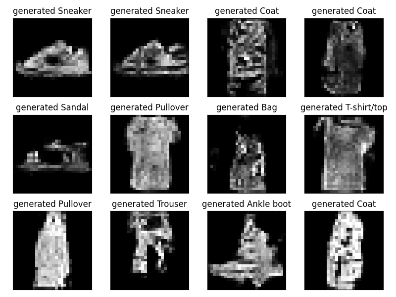
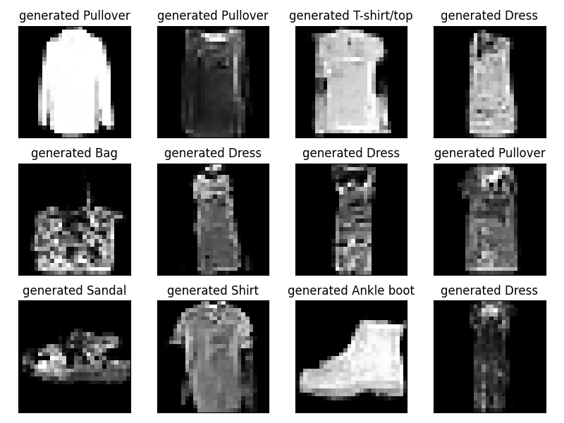
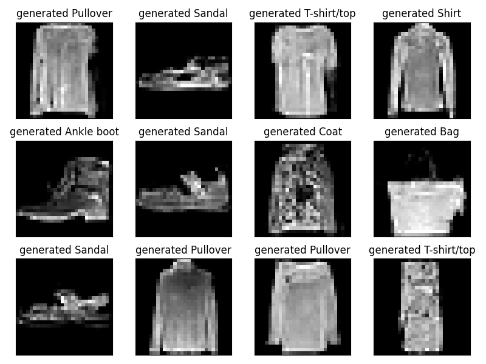

# CGAN_Fashion_Clothing_Data
implementing Conditional GAN (DGAN) using Fashion Clothing Dataset.
The [Fashion-MNIST dataset](https://github.com/zalandoresearch/fashion-mnist) comprises 6000 small, square, grayscale training photographs of items of clothing from ten different categories, including shoes, t-shirts, dresses, and more and 10000 test images.
Each image in the dataset has the size of 28x28 pixels.

To optimally train a CGAN, both the generator and discriminator must be trained simultanously. 

## Results

Below are some examples of images generated by the CGAN during training:

*Generated images at Epoch 10.*
  

*Generated images at Epoch 60.*
  

*Generated images at Epoch 120.*
  
